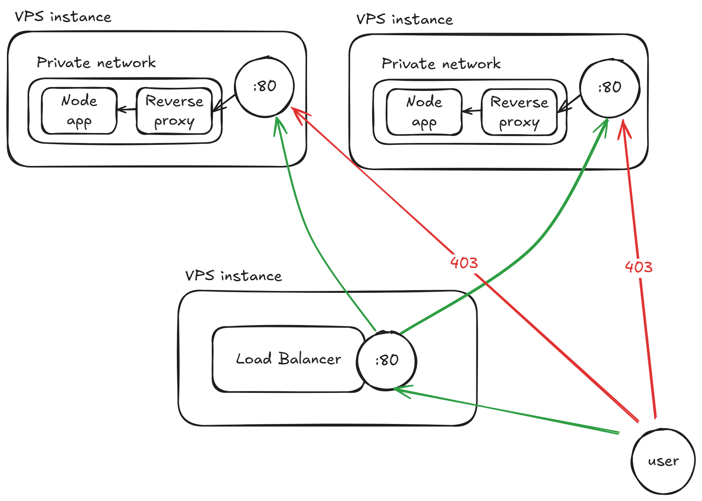

# Ansible lab
This project is a lab environment designed to practice core Ansible concepts. It uses bare-metal VPS instances as target servers to deploy multiple instances of a simple Node.js application, along with a load balancer to distribute traffic between them.

# Design

This lab simulates a real-world infrastructure scenario to practice Ansible automation using bare-metal VPS instances. The setup includes application servers, a load balancer, Docker provisioning, and strict access control.

Key Components:
1. **Bare-Metal VPS Environment**.
The entire lab runs on bare-metal VPS instances to mimic real deployment environments.

2. **Docker Provisioning**.
Each instance is automatically provisioned with Docker using Ansible.

3. **Application Layer**
Multiple VPS instances are used to run a simple Node.js application. These application containers are not exposed to the public and are isolated from external access.

4. **Reverse Proxy for Application**.
Each Node.js instance includes a reverse proxy (NGINX) listening on port `80`. This proxy:
    - Forwards traffic to the local Node.js container
    - Is configured to only accept requests from the load balancer's IP
    - Rejects all other incoming traffic automatically

5. **Centralized Load Balancer**.
A dedicated VPS instance runs an NGINX load balancer that distributes traffic across all Node.js application instances.

# CI/CD Automation with GitHub Actions

This lab also includes two automated workflows implemented using GitHub Actions:

1. **Provisioning Workflow**

    This workflow accepts a list of IP addresses for newly created VPS instances and performs the initial provisioning. It:

    - Creates an Ansible user on each VPS

    - Sets up SSH key authentication

    - Prepares the instances for further configuration

2. **Deployment Workflow**

    This workflow installs Docker on all VPS instances, dynamically generates the Ansible inventory file based on provided IPs, and runs the necessary Docker containers:

    - Node.js application instances on designated VPS hosts

    - Reverse proxies configured to only allow traffic from the load balancer

    - A centralized load balancer to distribute traffic across application nodes